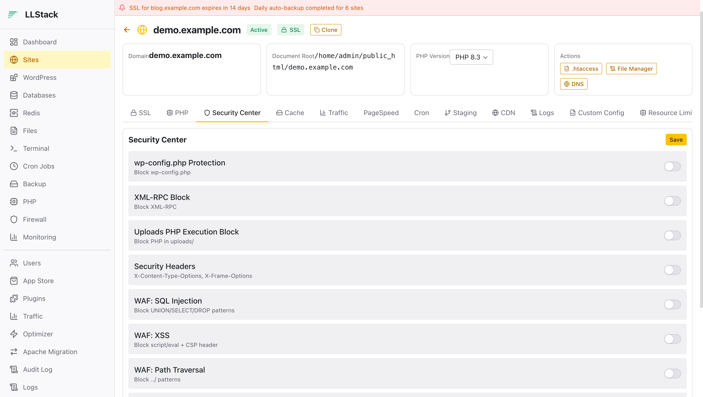
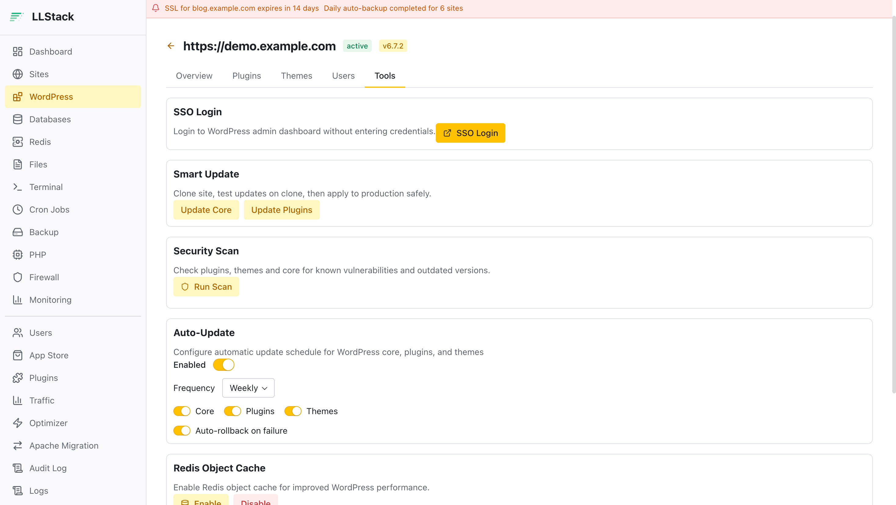
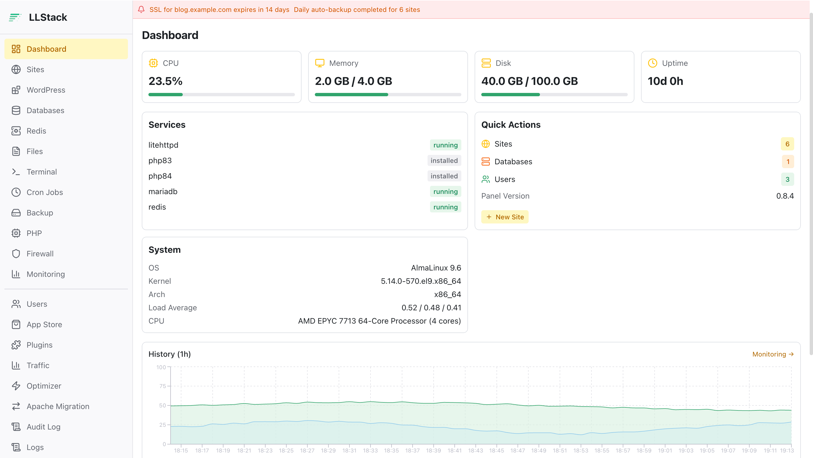

<div align="center">
  
  <h1>LLStack 面板</h1>
  <p><strong>基於 LiteHttpd 的開源伺服器管理面板</strong></p>
  <p>Apache 等級的 <code>.htaccess</code> 相容性 · LiteSpeed 等級的效能</p>
  <p>
    <a href="https://llstack.com">官網 & 文件</a> ·
    <a href="https://demo.llstack.com">線上 Demo</a> ·
    <a href="https://llstack.com/reference/changelog/">更新日誌</a> ·
    <a href="README.md">English</a> ·
    <a href="README_CN.md">简体中文</a>
  </p>
</div>

---

## 介面預覽

<div align="center">
  
  
  
</div>

## 一鍵安裝

```bash
curl -fsSL https://raw.githubusercontent.com/web-casa/LLStack/main/scripts/install.sh | sudo bash
```

安裝完成後造訪 `https://你的伺服器IP:30333` 建立管理員帳號。

**系統需求**：AlmaLinux / Rocky Linux / CentOS Stream 9 或 10 · 1GB 記憶體 · 5GB 磁碟

## 功能特色

### 核心服務

| 功能 | 說明 |
|------|------|
| **LiteHttpd 引擎** | OpenLiteSpeed + 80 種 .htaccess 指令，2.5 倍 Apache 效能 |
| **PHP 多版本** | PHP 7.4 ~ 8.5 (REMI 套件庫)，php-litespeed SAPI（非 php-fpm） |
| **資料庫管理** | MariaDB / MySQL / Percona / PostgreSQL，匯入匯出克隆維護，Adminer SSO |
| **Redis 管理** | 使用者隔離實例，物件快取，ACL 權限管理 (6.0+) |
| **SSL 憑證** | Let's Encrypt 自動簽發續期，手動上傳，強制 HTTPS |

### WordPress 工具箱（24 個 API 端點）

- 一鍵安裝，外掛/佈景主題管理，SSO 免密碼登入
- **Wordfence CVE 漏洞掃描** — 33,000+ 漏洞資料，CVSS 評分
- Smart Update（克隆 → 測試 → 套用）+ 自動更新排程
- Redis 物件快取整合
- 失敗自動回滾

### 維運功能

| 功能 | 說明 |
|------|------|
| **Staging 環境** | 一鍵克隆，Push/Pull（檔案/資料庫/全部），網域自動替換 |
| **增量備份** | restic 去重 + AES-256 加密，1h–24h 排程，選擇性還原 |
| **CDN 整合** | Cloudflare 一鍵設定，快取清除 |
| **系統監控** | CPU/記憶體/磁碟，Redis 趨勢，cgroup 壓力 |

### 安全防護

- **RBAC 多角色** — 4 角色：Owner / Admin / Developer / Viewer
- **ALTCHA** — PoW 工作量證明防暴力破解（無驗證碼）
- **2FA 雙因素** — TOTP，支援 Google Authenticator / Authy
- JWT 驗證，稽核日誌，per-site `disable_functions`
- Plan 資源配額（網站數、資料庫數、磁碟配額）

### 更多功能

- 檔案管理員 + WebSocket 線上終端機 (xterm.js)
- Cron 排程任務，防火牆 (firewalld)，日誌輪替
- Apache 一鍵遷移 (litehttpd-confconv)
- 應用程式商店（WordPress / Laravel / Typecho）
- 國際化：简体中文 / 繁體中文 / English

## 系統架構

```
瀏覽器 → LiteHttpd :30333 (HTTPS)
            ├── /api/*  → gunicorn :8001 (Flask + SQLite)
            ├── /ws/*   → gunicorn :8001 (WebSocket 終端機)
            └── /*      → dist/ (React 19 + Radix UI)
```

- **後端**：Python 3.12 + Flask，SQLite (WAL 模式)，245+ pytest 測試
- **前端**：React 19 + Radix UI + Vite（預先建置，伺服器無需 Node.js）
- **指令稿**：43 個 shell 指令稿，透過 sudoers 呼叫

## 文件

完整文件請造訪 **[llstack.com](https://llstack.com)**

- [IT 管理員指南](https://llstack.com/guide/for-admins/) — 安裝、設定、維運
- [網站使用者指南](https://llstack.com/guide/for-users/) — 網站管理、WordPress、資料庫
- [獨立開發者指南](https://llstack.com/guide/for-developers/) — 全端工作流、API 參考
- [LiteHttpd 引擎](https://llstack.com/guide/litehttpd/) — .htaccess 相容性、效能基準
- [常見問題](https://llstack.com/reference/faq/)

## 效能比較

| 指標 | Apache 2.4 | Stock OLS | LiteHttpd |
|------|:----------:|:---------:|:---------:|
| 靜態 RPS | 23,909 | 63,140 | **58,891** |
| PHP RPS (wp-login) | 274 | 258 | **292** |
| 記憶體佔用 | 818 MB | 654 MB | **689 MB** |
| .htaccess 相容 | 10/10 | 6/10 | **10/10** |

*測試環境：Linode 4C/8G，EL9，PHP 8.3，MariaDB 10.11*

## 競品比較

| 功能 | LLStack | 寶塔 | CyberPanel | Plesk |
|------|:-------:|:----:|:----------:|:-----:|
| .htaccess 相容 | 80+ 指令 | Nginx | 部分 | Apache |
| WordPress 工具箱 | 完整 | 基礎 | 基礎 | 完整 |
| CVE 漏洞掃描 | Wordfence | 無 | 無 | 有 |
| Staging 環境 | 有 | 無 | 無 | 有 |
| 增量備份 | restic | tar.gz | tar.gz | 有 |
| RBAC 多角色 | 4 角色 | 無 | 無 | 有 |
| 開源 | 是 | 部分 | 是 | 否 |
| 價格 | 免費 | 免費/付費 | 免費 | 付費 |

## 相關專案

- [LiteHttpd](https://litehttpd.com) — 高度相容 Apache 的輕量化 Web Server
- [WebCasa](https://web.casa) — 更 AI Native 的開源伺服器控制面板

## 授權條款

GPLv3 — 詳見 [LICENSE](LICENSE)
